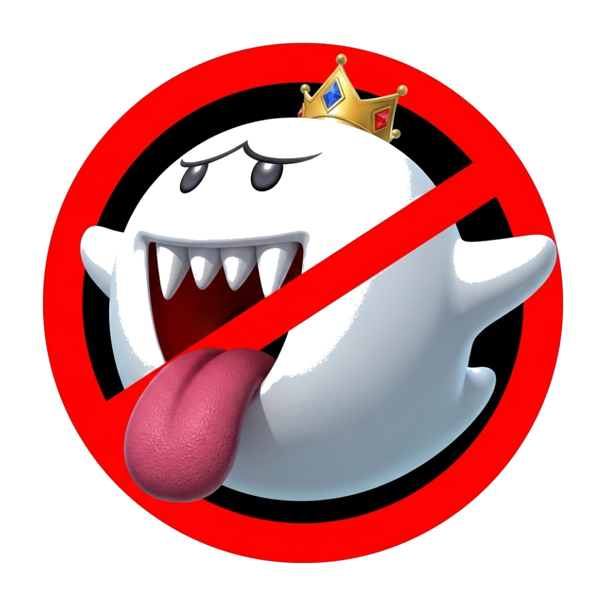

<div align="center">

  

  # MKW Ghostbusters - Easy Time Trial Ghost Sharing


  </div>


LAN ghost-share for Mario Kart Wii on Dolphin. Two (or more) friends, same network → one click sends a PB ghost from your `rksys.dat` to your friend's Downloaded slot.

Manually finding your save file, extracting time trials & importing them on another save file is a thing of the past! 

Massive shout-out to TT-Rec for building the ghost manager script! (https://github.com/AtishaRibeiro/TT-Rec-Tools)

## What it does

- Discovers a friend on your LAN automatically (mDNS), with manual IP fallback for picky firewalls
- (Considering plans for online transfer, but for the moment this was developed for my housemate and I to easily transfer ghosts) 
- PIN-paired, HMAC-signed ghost transfers — only people you've paired with can send you anything
- Inline track comparison: see your PB vs your friend's PB on every track, with per-lap delta charts
- Auto-share new PBs the moment Dolphin saves them (toggle in Settings)
- Slot management with optional zip backup when your 32-slot Downloaded area fills up
- Auto-import the moment Dolphin closes if it had the save locked when an offer arrived
- Native Windows toasts and a tray icon

## Run from source

```sh
npm install
npm start
```

## Build a Windows installer

```sh
npm run package
```

Output: `dist/MKW Ghostbusters Setup <version>.exe`. The installer kills any
running instance, silently uninstalls the previous version, and installs in
place — no manual uninstall step needed.

## Tests

```sh
npm test
```

Unit + integration suites cover the YAZ1 codec, `.rkg` validator, full
`rksys.dat` round-trips, pairing crypto, offer signing, and an end-to-end
two-instance pair-and-send.

## Auto-update manifest

If you host a JSON file like:

```json
{
  "version": "0.6.1",
  "downloadUrl": "https://example.com/MKW%20Ghostbusters%20Setup%200.6.1.exe",
  "notes": "Fixes the unknown-id timeout race."
}
```

… and paste the URL into Settings → Update manifest URL, the app polls
every 6 hours and shows an "update available" banner when the version is
newer than the installed one.
